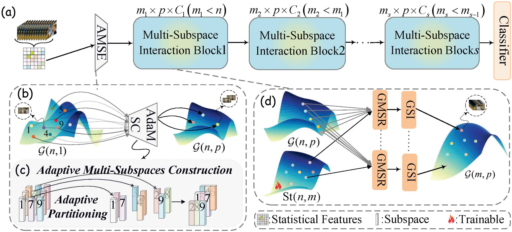

# GMSF-Net

Version 1.0,  Copyright(c) December, 2025. 

This is the source code of our AAAI paper, "[Learning Topology-Driven Multi-Subspace Fusion for Grassmannian Deep Networks](https://arxiv.org/abs/2511.08628)". 
This implementation is built upon the publicly available codes of **SPDBN** and **GDLNet**.. 
All the settings are consistent with the description in the main paper.
If you have any queries, please do not hesitate to contact me 6243114042@stu.jiangnan.edu.cn.

Usage:

Step 1: Download the preprocessed FPHA dataset from the [SymNet]([GitWR/SymNet: This is a matlab implementation of our article, named "SymNet: A Simple Symmetric Positive Definite Manifold Deep Learning Method for Image Set Classification", recently accepted by IEEE Transactions on Neural Networks and Learning Systems (TNNLS).](https://github.com/GitWR/SymNet))

Step 2: Unzip the dataset into '.\data'.

Step 3: Launch FPHA.py for a simple example.

## Overall Framework



## Reference

```bibtex
@inproceedings{wang2024grassmannian,
  title={A Grassmannian Manifold Self-Attention Network for Signal Classification},
  author={Wang, Rui and Hu, Chen and Chen, Ziheng and Wu, Xiao-Jun and Song, Xiaoning},
  booktitle={Proceedings of the Thirty-Third International Joint Conference on Artificial Intelligence},
  pages={5099--5107},
  year={2024}
}
```

```bibtex
@inproceedings{NEURIPS2019_6e69ebbf,
 author = {Brooks, Daniel and Schwander, Olivier and Barbaresco, Frederic and Schneider, Jean-Yves and Cord, Matthieu},
 booktitle = {Advances in Neural Information Processing Systems},
 editor = {H. Wallach and H. Larochelle and A. Beygelzimer and F. d\textquotesingle Alch\'{e}-Buc and E. Fox and R. Garnett},
 pages = {},
 publisher = {Curran Associates, Inc.},
 title = {Riemannian batch normalization for SPD neural networks},
 url ={https://proceedings.neurips.cc/paper_files/paper/2019/file/6e69ebbfad976d4637bb4b39de261bf7-Paper.pdf},
 volume = {32},
 year = {2019}
}
```

```bibtex
@article{wang2021symnet,
  title={SymNet: A simple symmetric positive definite manifold deep learning method for image set classification},
  author={Wang, Rui and Wu, Xiao-Jun and Kittler, Josef},
  journal={IEEE Transactions on Neural Networks and Learning Systems},
  volume={33},
  number={5},
  pages={2208--2222},
  year={2021},
  publisher={IEEE}
}
```
